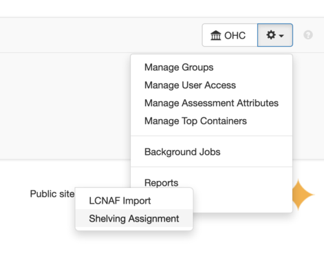
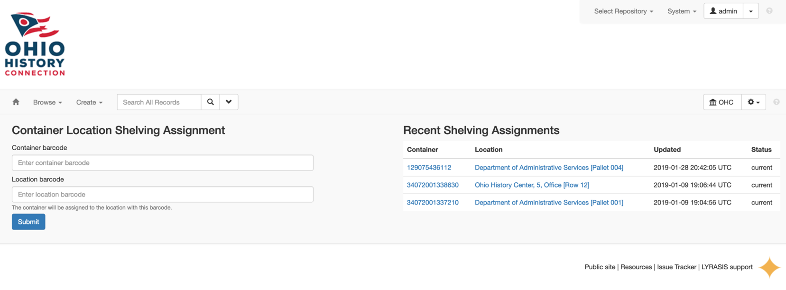

# Shelve it!

A plugin for assigning containers to locations.

## Installation

Download this plugin to `$ARCHIVESSPACE_DIR/plugins` and enable it in the config:

```ruby
AppConfig[:plugins] << "shelve_it"
```

## Usage

The plugin adds a new repository plugins menu option:



This provides access to the Shelving Assignment UI:



_Only users with permission to update containers and locations will have access._

The form provides fields for:

- container barcode
- location barcode

Inputting valid barcodes will update the container location. The
"Recent Sheliving Assignments" table provides visual feedback on
what was updated.

## License

This project is available as open source under the terms of the [MIT License](http://opensource.org/licenses/MIT).

---